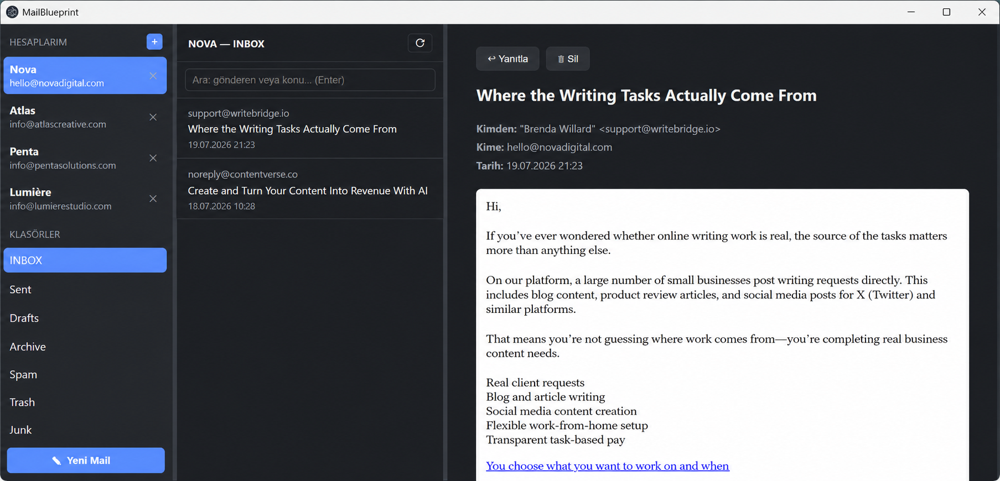

# MailBlueprint


A blueprint repository for making Claude build a full **multi-account desktop mail client** (Electron + IMAP/SMTP, Outlook-style) **from a single prompt**. There is no application code here — only the specification Claude needs to build the app correctly, completely, and without falling into pitfalls that were already hit and fixed once.

## Files

| File | Purpose |
|---|---|
| `CLAUDE.md` | Instructions for Claude while working in this repo: build order, verification steps, delivery criteria |
| `blueprint.md` | The full technical spec: architecture, features, IPC contract, critical implementation details, and lessons learned from real bugs already hit and fixed |
| `RULES.md` | Non-negotiable rules: security, language, error handling, performance |
| `.gitignore` | node_modules, dist, etc. |

## How to use it

1. Clone this repo (or copy these files into an empty folder).
2. Open Claude Code in that folder.
3. Write a single prompt:

```
Build the app from scratch following blueprint.md and RULES.md, using the build
order and verification steps in CLAUDE.md.
```

Claude will scaffold the project, install dependencies, implement every feature, run and verify the app, build a Windows installer (`.exe`), and run it — so the app ends up installed like any normal Windows program, with a desktop icon you can double-click to open it.

## The resulting app

- Unlimited IMAP/SMTP accounts (cPanel/Roundcube and any standard provider), one-click account switching
- Three-pane Outlook-style layout, dark theme, fully Turkish UI (the target users are Turkish-speaking cPanel/Roundcube customers)
- Read mail (sandboxed HTML rendering), send mail (rich text + attachments), delete (move to trash), reply
- Server-side search, new-mail notifications, attachment download
- Passwords encrypted with Windows DPAPI (`safeStorage`); all error messages are translated and user-friendly
- Ships as a real installed Windows app via `electron-builder` (NSIS installer, desktop + Start Menu shortcuts) — launched with a double-click, not from a terminal
